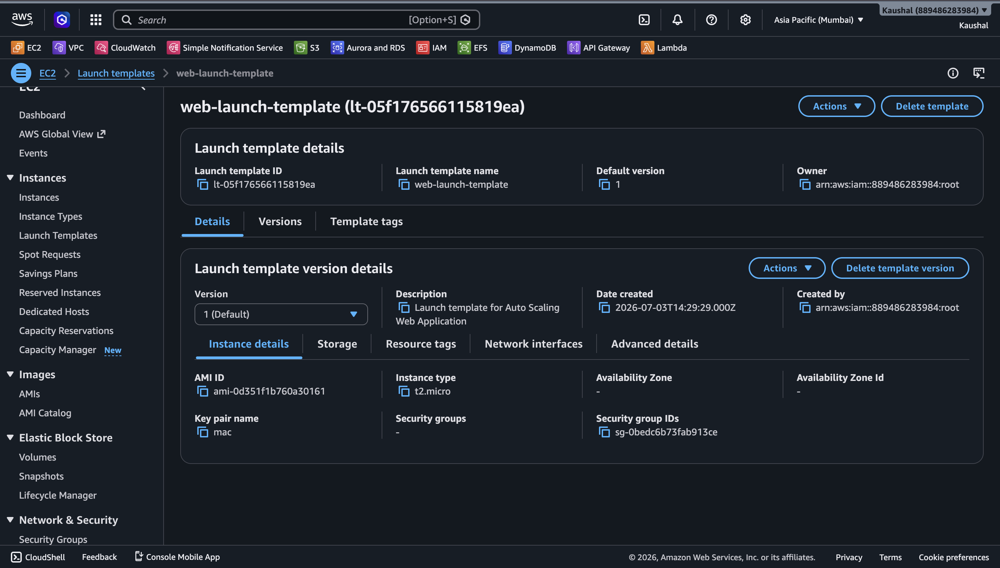
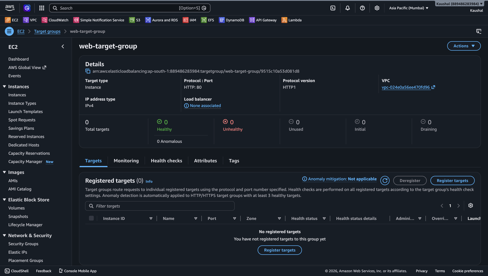
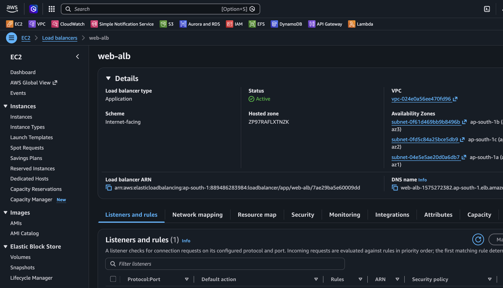
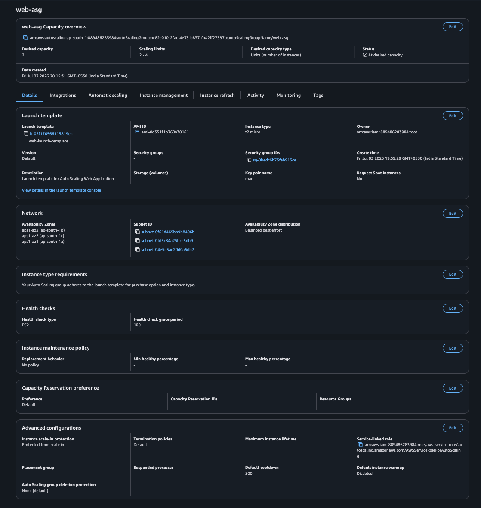
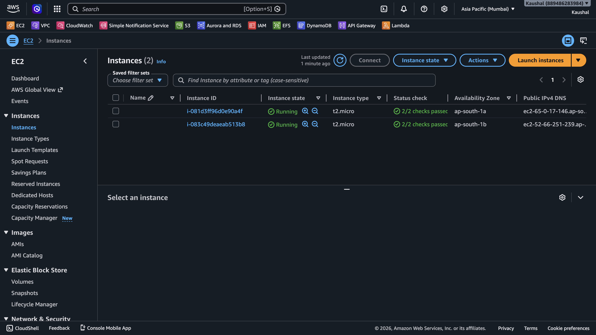
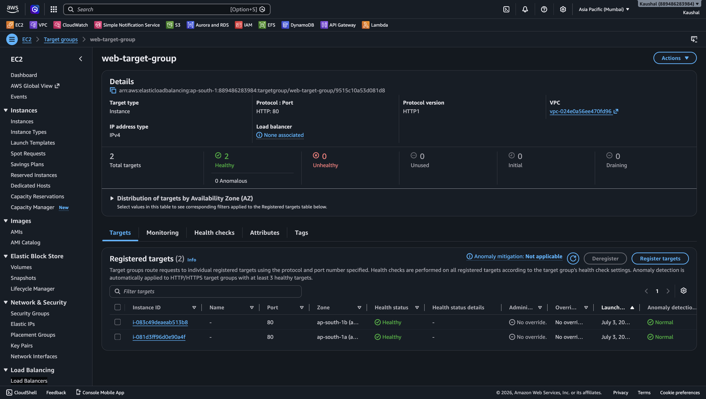
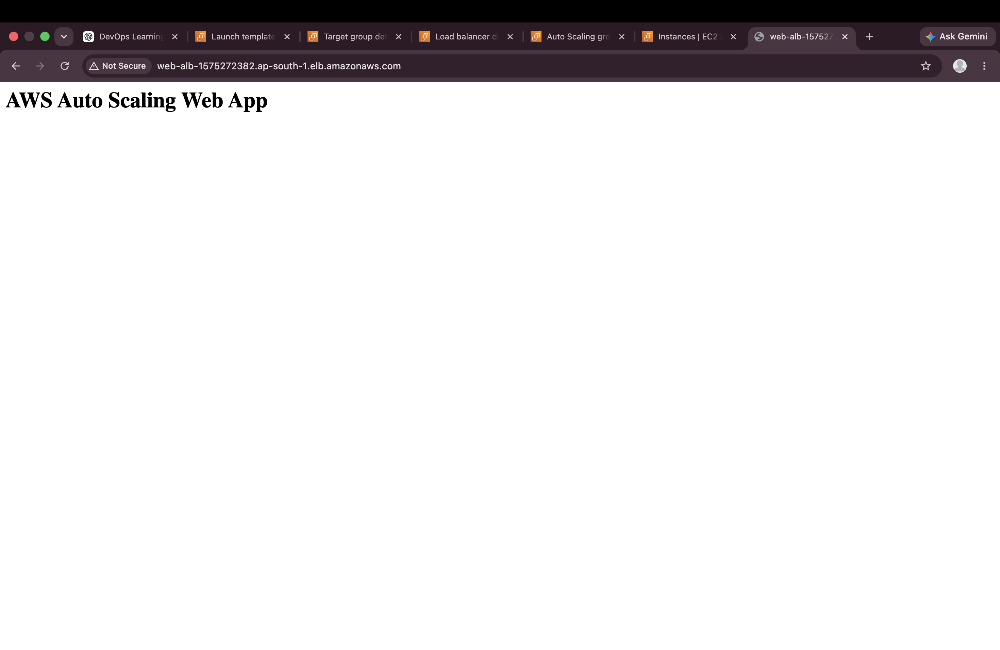

# AWS Auto Scaling Web App

## 📖 Project Overview

This project demonstrates how to automatically scale Amazon EC2 instances using AWS Auto Scaling Group and Application Load Balancer.

When traffic increases, the Auto Scaling Group automatically launches new EC2 instances. When traffic decreases, unnecessary instances can be terminated automatically.

---

## ☁️ AWS Services Used

- Amazon EC2
- Launch Template
- Target Group
- Application Load Balancer (ALB)
- Auto Scaling Group
- CloudWatch (for scaling policies)

---

## 🏗️ Architecture

```
Internet
     │
     ▼
Application Load Balancer
     │
     ▼
Target Group
     │
 ┌───┴────┐
 │        │
EC2      EC2
     ▲
     │
Auto Scaling Group
```

---

## 📂 Project Structure

```
aws-auto-scaling-web-app/
│
├── Architecture/
├── Docs/
├── Screenshots/
│   ├── 01-launch-template.png
│   ├── 02-target-group.png
│   ├── 03-load-balancer.png
│   ├── 04-auto-scaling-group.png
│   ├── 05-ec2-instances-running.png
│   ├── 06-target-group-healthy.png
│   └── 07-final-webpage.png
│
├── Scripts/
│   └── userdata.sh
│
└── README.md
```

---

# 🚀 Deployment Steps

### Step 1 - Create Launch Template

Created a Launch Template with:

- Amazon Linux 2023
- t2.micro Instance
- Security Group
- Key Pair
- User Data Script

### Screenshot



---

### Step 2 - Create Target Group

Created an Instance Target Group using HTTP on Port 80.

### Screenshot



---

### Step 3 - Create Application Load Balancer

Created an Internet-facing Application Load Balancer connected to the Target Group.

### Screenshot



---

### Step 4 - Create Auto Scaling Group

Configured Auto Scaling Group with:

- Minimum Capacity: 2
- Desired Capacity: 2
- Maximum Capacity: 4

### Screenshot



---

### Step 5 - EC2 Instances Running

Auto Scaling automatically launched EC2 instances.

### Screenshot



---

### Step 6 - Healthy Target Group

Both EC2 instances became healthy in the Target Group.

### Screenshot



---

### Step 7 - Final Web Application

Successfully accessed the application using the Load Balancer DNS.

### Screenshot



---

# 📜 User Data Script

```bash
#!/bin/bash

dnf -y update
dnf -y install httpd
systemctl enable --now httpd

echo "<h1>AWS Auto Scaling Web App</h1>" > /var/www/html/index.html
```

---

# 🎯 Skills Demonstrated

- Amazon EC2
- Launch Templates
- Auto Scaling Groups
- Application Load Balancer
- Target Groups
- User Data Scripts
- Linux Administration
- High Availability
- Load Balancing
- AWS Networking

---

# ✅ Result

Successfully deployed a highly available web application using AWS Auto Scaling and Application Load Balancer. The infrastructure automatically launches multiple EC2 instances behind a Load Balancer to improve availability and scalability.